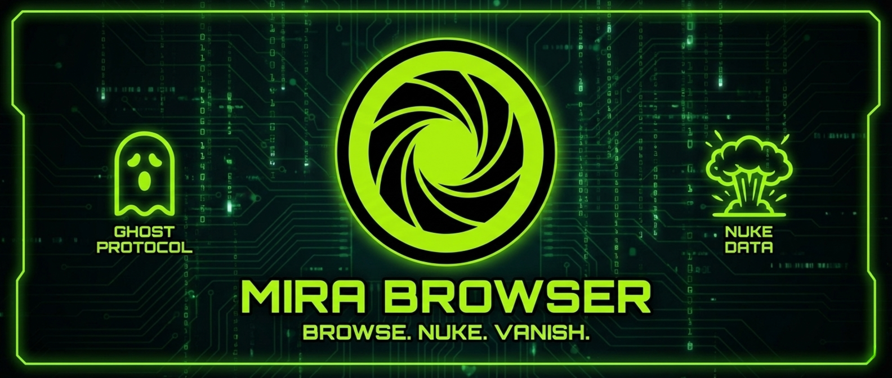
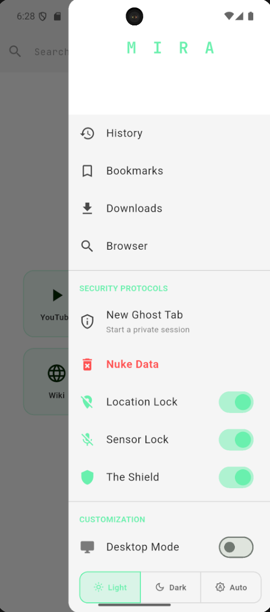
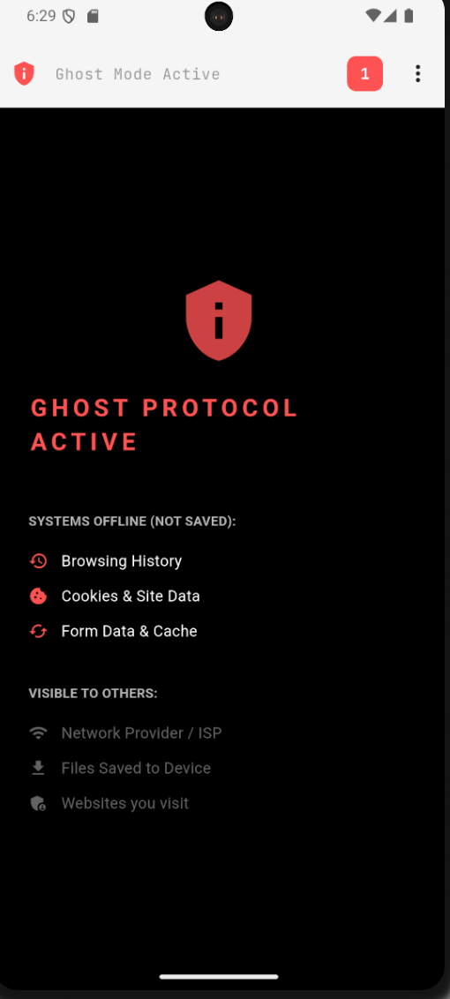
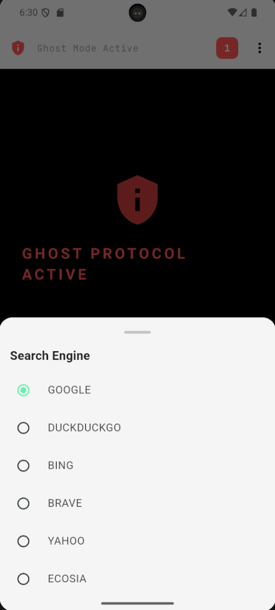
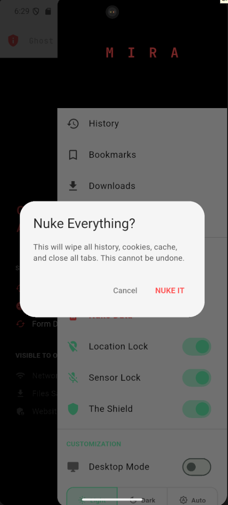
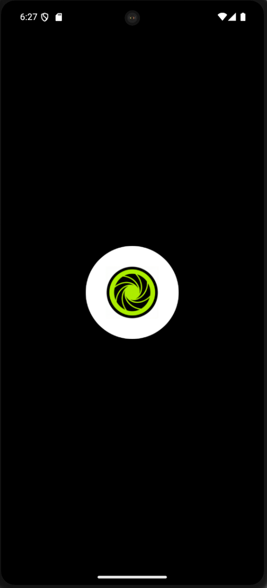
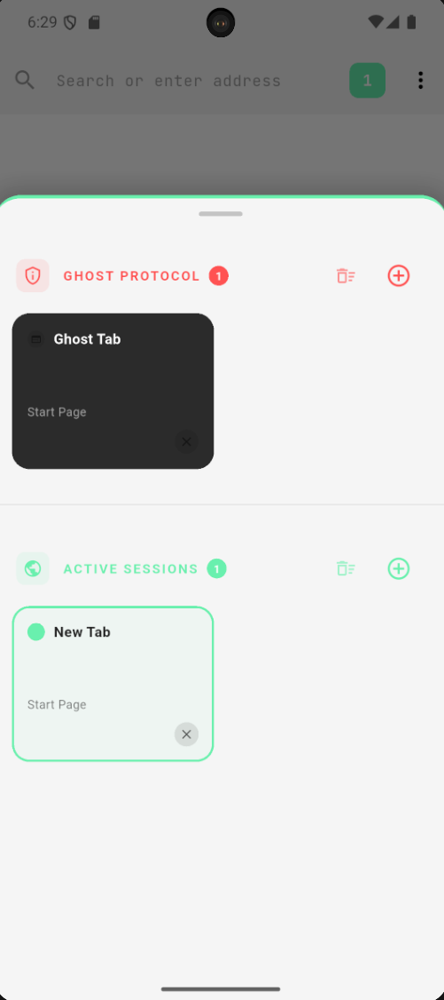
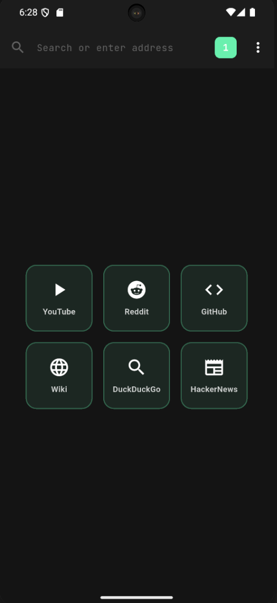

# MIRA Browser



> **"Browse. Nuke. Vanish."**

MIRA is a tactical, privacy-focused web browser built with **Flutter**. It is designed to be a lightweight, aggressive alternative to mainstream browsers, stripping away surveillance code before it even loads.

## 🚀 Why MIRA?

Most "Incognito" modes are fake—they just stop saving history to your device but still allow ISPs and websites to track you. MIRA takes a different approach:

* **🛡️ Aggressive Shielding:** We intercept `XML_HTTP_REQUESTS` at the network layer. We don't just hide ads; we kill the connection to trackers, crypto miners, and session recorders (like Hotjar) before they handshake.
* **👻 Ghost Protocol:** A dual-state architecture. Normal tabs write to disk; Ghost tabs write only to RAM. Closing a Ghost tab physically destroys the data instance.
* **💥 The Nuke Button:** One tap to incinerate everything. This isn't just clearing your history. MIRA's Nuke function performs a deep system purge:
    * **Wipes:** Cookies, Local Storage, Session Storage, and HTTP Cache.
    * **Destroys:** Saved Passwords, Form Data, and Autofill entries.
    * **Kills:** All active `WebView` controllers and isolates immediately.

## 📸 Screenshots

### A Tactical Experience
From the clean welcome screen to the powerful menu, MIRA is built for speed and control.

| **Welcome Screen** | **MIRA Menu** |
| :---: | :---: |
|  |  |

### Ghost Protocol: True Privacy
When Ghost Protocol is active, your browsing data is never saved to the device. The interface shifts to a "High-Contrast" dark mode, and the landing page confirms exactly what systems are offline.

| **Ghost Landing Page** | **Ghost Active State** |
| :---: | :---: |
|  |  |

### The Power of Nuke
With a single tap, the "Nuke Everything" confirmation appears. Confirming this action triggers a system-wide purge.

| **Nuke Confirmation** | **Secure Loading** |
| :---: | :---: |
|  |  |

### Tab Management & Speed Dial
MIRA uses a "Split-State" Tab Manager. "Ghost Tabs" (Dark Grey) live in RAM, while "Active Sessions" (Light/Themed) persist.

| **Split-State Tab Manager** | **Tactical Speed Dial** |
| :---: | :---: |
|  |  |

## ✨ Features

### Core Experience
* **Multi-Tab Engine:** Visual grid view with separate states for Normal and Ghost tabs.
* **Smart Search:** Auto-detection of URLs vs. Search Terms.
* **Desktop Mode:** Force-load desktop sites with a custom User-Agent string.
* **Theme Engine:** Automatic Light/Dark mode syncing with the underlying WebView renderer.

### Privacy Engineering
* **Session Recorder Blocking:** Blocks scripts that record video of your screen usage.
* **Granular Permissions:** Hard blocks for Camera, Microphone, and Location sensors.
* **Self-Healing Connections:** Automatically repairs "Zombie Controllers" (null WebView states) when the app resumes from the background.

## 🛠️ Technical Stack

* **Framework:** Flutter (Dart)
* **Engine:** `flutter_inappwebview` (Custom implementation)
* **State Management:** Riverpod (Dual-state architecture)
* **Storage:** Secure Storage & Hive

## ⚡ Getting Started

1.  **Clone the repository:**
    ```bash
    git clone [https://github.com/your-username/mira.git](https://github.com/your-username/mira.git)
    ```
2.  **Install dependencies:**
    ```bash
    flutter pub get
    ```
3.  **Run on Android:**
    ```bash
    flutter run
    ```

## 🤝 Contributing

MIRA is open-source. We welcome PRs for:
* New AdBlock Regex rules.
* UI/UX polish.
* Performance optimizations.

---
*Built with 💻 and ☕ by Sarthak.*