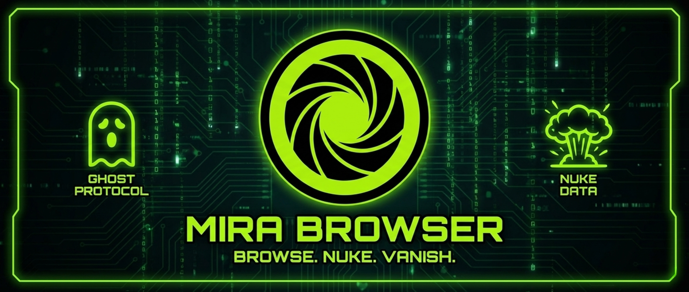
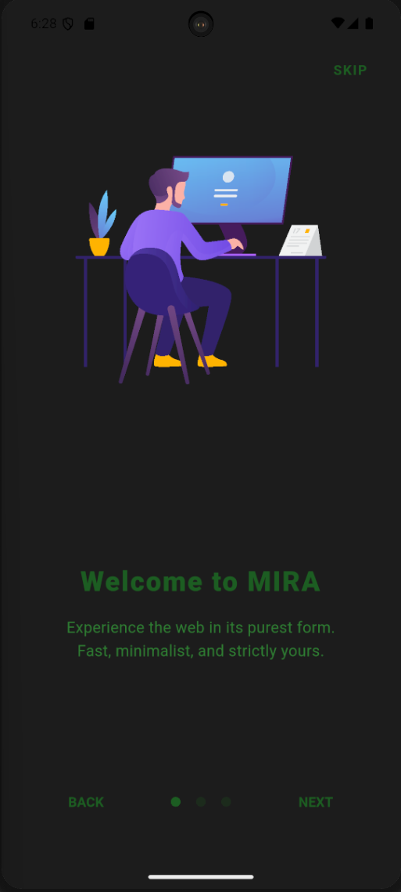
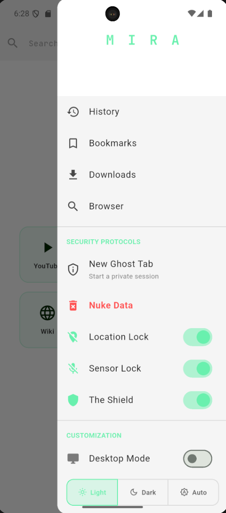
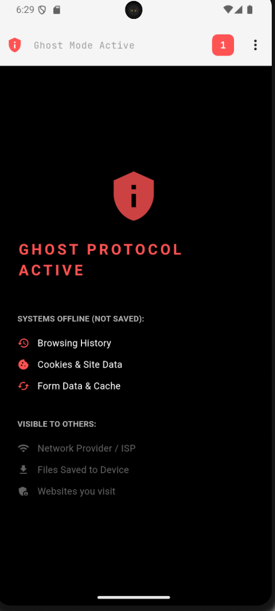
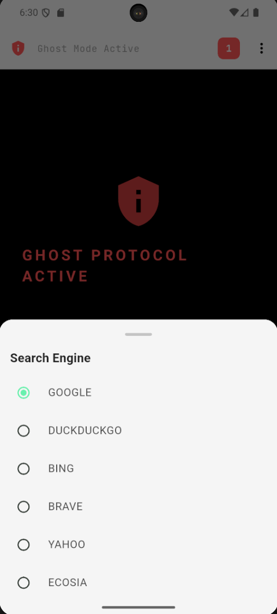
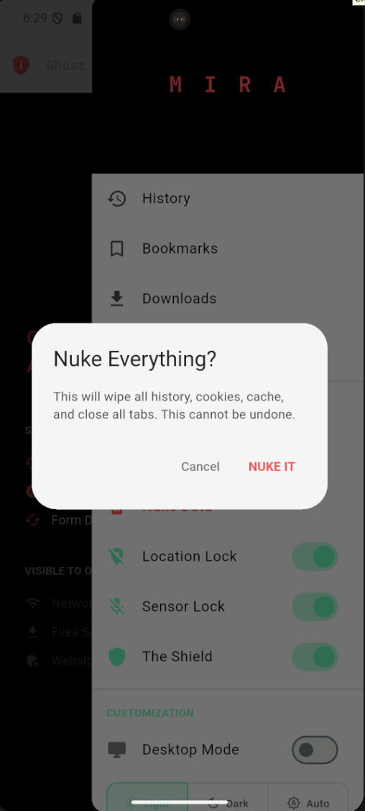
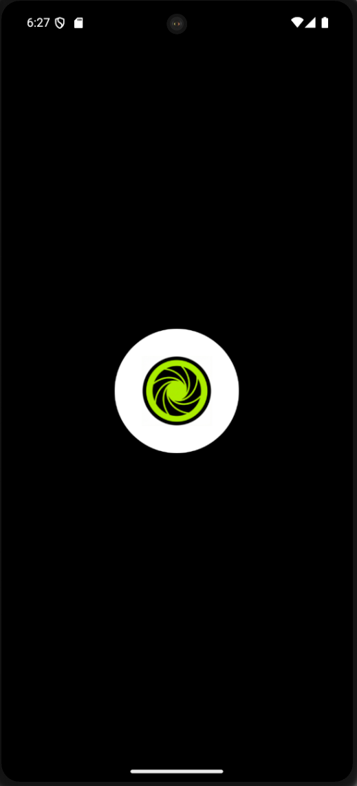
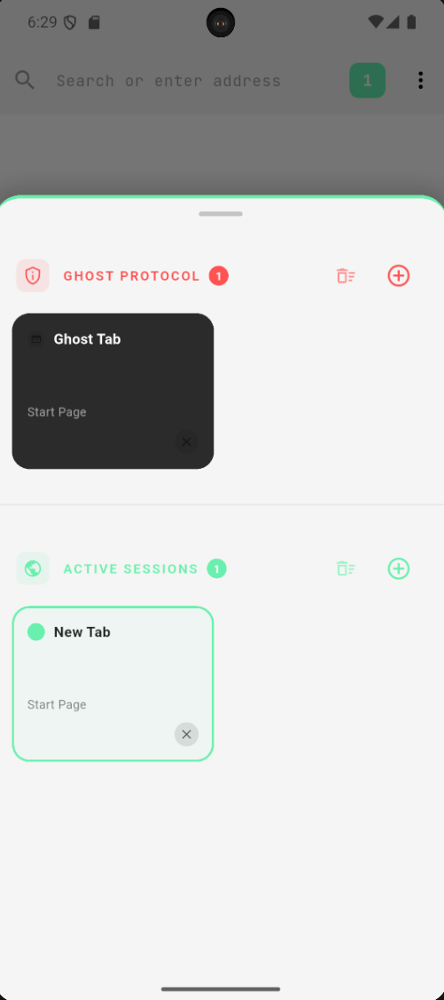
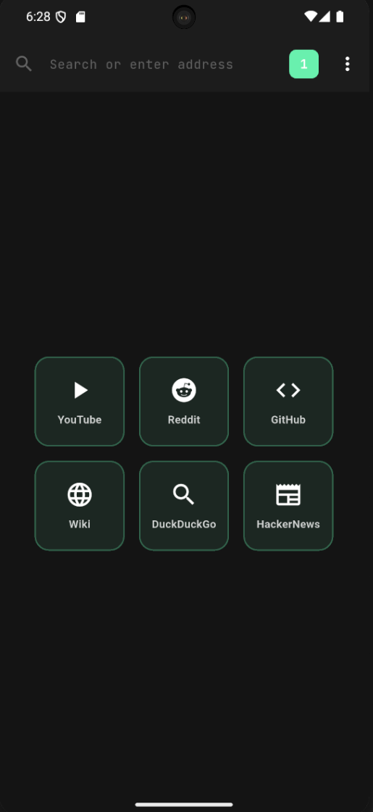

# MIRA Browser



> **"Browse. Nuke. Vanish."**

MIRA is a tactical, privacy-focused web browser built with **Flutter**. Designed as a lightweight, aggressive alternative to mainstream browsers — stripping surveillance code before it even loads, across every platform it runs on.

---

## Why MIRA?

Most "Incognito" modes are fake. They stop saving history to your device but still allow ISPs, advertisers, and websites to track everything you do. MIRA takes a different approach.

**Aggressive Shielding.** Network-layer interception of requests to trackers, crypto miners, and session recorders before they handshake. Not hidden — killed.

**Ghost Protocol.** A dual-state architecture. Normal tabs write to disk. Ghost tabs write only to RAM. Closing a Ghost tab physically destroys the data instance.

**The Nuke Button.** One tap to incinerate everything. Cookies, Local Storage, Session Storage, HTTP Cache, Form Data, all active WebView controllers — gone.

---

## Screenshots

### A Tactical Experience

| **Welcome Screen** | **MIRA Menu** |
| :---: | :---: |
|  |  |

### Ghost Protocol: True Privacy

| **Ghost Landing Page** | **Ghost Active State** |
| :---: | :---: |
|  |  |

### The Power of Nuke

| **Nuke Confirmation** | **Secure Loading** |
| :---: | :---: |
|  |  |

### Tab Management & Speed Dial

| **Split-State Tab Manager** | **Tactical Speed Dial** |
| :---: | :---: |
|  |  |

---

## Current State — v0.8 Stable (In Progress)

MIRA is in active development toward its first stable release. The core browser engine is complete and battle-tested. All Priority 1 crash bugs are closed. App Store submission blockers are being resolved now.

### What Works Today

- Multi-tab browsing with LRU memory management (max 3 live WebViews, hibernation for the rest)
- Ghost Protocol with fully isolated tab session — no history, cookies, or cache
- Speed dial, bookmarks, and browsing history
- Ad blocking at network layer and content layer
- Location, camera, and microphone blocking (default on)
- Proxy support — Android native PROXY_OVERRIDE, iOS local gateway
- Proxy lifecycle tied to app foreground/background state
- Downloads on Android, iOS, and desktop with real-time progress
- Nuke Everything — deep system purge in one tap
- 5 color themes with Light, Dark, and Auto mode
- Desktop mode with custom user agent
- Custom error screens with self-healing connection recovery
- Full platform support: Android, iOS, Windows, macOS, Linux

### Recently Fixed

| ID | Fix |
|----|-----|
| C01 | Stale WebView controller after LRU tab eviction |
| C02 | iOS proxy server not shutting down on app background |
| C03 | flutter_downloader callback firing on dead isolate |
| C04 | WebView2 controller accessed before ready on Windows |
| C05 | Unhelpful error on preferences service failure |
| C06 | Missing error boundary on notifier exceptions |
| A01 | iOS PrivacyInfo and usage descriptions |
| A02 | Android manifest permissions and Data Safety |

---

## Feature Roadmap

### v0.8 Stable
> Gate: All crashes fixed + App Store submissions unblocked

- [x] All Priority 1 crashes closed
- [x] iOS PrivacyInfo and usage descriptions
- [x] Android manifest permissions and Data Safety
- [ ] macOS sandbox entitlements
- [ ] Force upgrade mechanism
- [ ] Certificate pinning on MIRA endpoints
- [ ] Mixed content policy enforcement
- [ ] Ad-block script tamper validation
- [ ] Safe Browsing integration
- [ ] Ad-block rules moved out of binary

---

### v0.9 Private Beta
> Gate: Privacy foundations + stable data layer

- [ ] Tracker blocking at request level
- [ ] Remote updatable filter lists (no app update required)
- [ ] HTTPS-only mode with interstitial warning
- [ ] DNS over HTTPS
- [ ] Third-party cookies blocked by default
- [ ] Clear on exit for normal mode
- [ ] Verified zero telemetry and zero outbound calls
- [ ] Schema versioning on local storage (safe migrations)
- [ ] Migrate to Isar or Drift structured database
- [ ] Desktop download progress persisted across restarts
- [ ] History with full timestamps and relative time display

---

### v1.0 Public Launch
> Gate: Competes directly with Brave on privacy + desktop UX complete

**Privacy Tier 2**
- [ ] Canvas fingerprint blocking
- [ ] WebGL fingerprint blocking
- [ ] User agent spoofing (per-site or global)
- [ ] Timezone and locale normalisation (report UTC regardless of device)
- [ ] First-party isolation per domain
- [ ] Referrer policy enforcement (no cross-origin leakage)
- [ ] Link decoration stripping (UTM params, fbclid, gclid auto-removed)
- [ ] Permission memory per site
- [ ] Privacy-preserving Safe Browsing (local hash check, no URL sent to Google)

**Desktop UX**
- [ ] Keyboard shortcuts (Cmd/Ctrl+T, W, R, L, arrow navigation)
- [ ] Window title updates with current page title
- [ ] Right-click custom context menu
- [ ] Configurable LRU tab limit per platform
- [ ] Tab drag to reorder + middle click to close
- [ ] Download stream cancellation on window close

---

### v1.5 Privacy Browser
> Gate: Mobile polish + privacy reporting

**Mobile Bug Fixes**
- [ ] Android storage permission re-request after denial
- [ ] Ghost tab controller recovery after hot restart
- [ ] iOS back gesture conflict resolution with WebView swipe
- [ ] Scroll position restoration after LRU eviction
- [ ] Ad-block CSS injection limited to main frame only
- [ ] Download progress preserved when navigating away

**Privacy Tier 3**
- [ ] Per-site privacy report (trackers blocked, cookies blocked, requests made)
- [ ] Filter list tamper detection (hash verification)
- [ ] On-device exportable crash logs (never uploaded automatically)
- [ ] Open source filter rules published on GitHub with versioning
- [ ] App Store listing explicitly states no cloud sync

---

### v2.0 Power User
> Gate: Full browser feature parity + advanced privacy controls

**Browser Fundamentals**
- [ ] Find in page with match count and navigation
- [ ] Print support via system dialog
- [ ] Share sheet integration (native mobile share)
- [ ] Reading mode (strip page to article content)
- [ ] Zoom persistence per site
- [ ] Per-domain cookie and site data management
- [ ] User-configurable speed dial
- [ ] WebView dark mode toggle per site

**Privacy Tier 4**
- [ ] First-class proxy/VPN integration (SOCKS5 and HTTP per profile)
- [ ] Custom DoH server UI
- [ ] Script blocking per site (whitelist/blacklist JavaScript per domain)
- [ ] Custom filter list import (URL or file upload)
- [ ] Tab isolation per tab (separate WebView context, no shared storage)
- [ ] Media device enumeration blocking

---

### v3.0 Activist Grade
> Gate: Nothing currently on the market competes here

**Observability & Accessibility**
- [ ] On-device crash reporting (exportable, never auto-uploaded)
- [ ] Full semantic labels on all UI elements (VoiceOver + TalkBack)

**Privacy Tier 5**
- [ ] Panic button (one tap wipes everything, returns to home screen)
- [ ] App lock with biometric authentication (Face ID, fingerprint)
- [ ] Screen capture prevention
- [ ] Network request log (local only, per-session, exportable as JSON)
- [ ] Steganographic icon option (MIRA can appear as a different app)
- [ ] Reproducible builds (verify binary matches source code)

---

## Competitive Position

| Version | Competes With |
|---------|---------------|
| v0.8 | Stock Android/iOS browser |
| v0.9 | Firefox Focus |
| v1.0 | Brave Browser |
| v1.5 | DuckDuckGo Browser |
| v2.0 | Tor Browser (on usability) |
| v3.0 | Nothing currently on the market |

---

## What MIRA Will Never Have

- Cloud sync of any kind
- Analytics or telemetry
- Advertising
- Account or login requirement
- Data sold or shared with third parties
- Remote kill switch on features

---

## Technical Stack

| Layer | Technology |
|-------|-----------|
| Framework | Flutter (Dart) |
| WebView Engine | flutter_inappwebview |
| State Management | Riverpod (Core/Shell dual-state architecture) |
| Local Storage | SharedPreferences → Isar/Drift (v0.9) |
| Downloads (Mobile) | flutter_downloader |
| Downloads (Desktop) | Native HttpClient streaming |
| iOS Proxy Gateway | shelf + shelf_proxy |
| Android Proxy | WebViewFeature.PROXY_OVERRIDE |
| Ad Blocking | Content blockers + domain blockers + CSS injection |

---

## Getting Started

**Clone the repository:**
```bash
git clone https://github.com/your-username/mira.git
```

**Install dependencies:**
```bash
flutter pub get
```

**Run on Android:**
```bash
flutter run
```

**Run on iOS:**
```bash
flutter run -d iPhone
```

**Run on Desktop:**
```bash
flutter run -d windows
flutter run -d macos
flutter run -d linux
```

---

## Contributing

MIRA is open source. PRs are welcome for:

- New ad-block filter rules
- UI and UX polish
- Performance optimizations
- Platform-specific bug fixes

Please read the architecture notes in the codebase before contributing. The Core/Shell pattern is intentional — platform implementations belong in `lib/shell/`, business logic belongs in `lib/core/`.

---

*Built by Sarthak.*