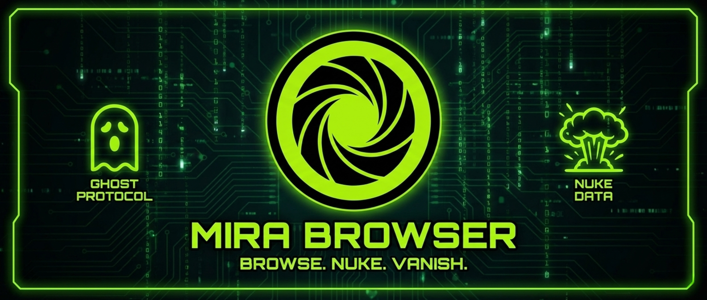

# MIRA Browser



> **"Browse. Nuke. Vanish."**

MIRA is a tactical, privacy-focused web browser built with **Flutter**. Designed as a lightweight, aggressive alternative to mainstream browsers — stripping surveillance code before it even loads, across every platform it runs on.

---

## Why MIRA?

Most "Incognito" modes are fake. They stop saving history to your device but still allow ISPs, advertisers, and websites to track everything you do. MIRA takes a different approach.

**Aggressive Shielding.** Network-layer interception of requests to trackers, crypto miners, and session recorders before they handshake. Not hidden — killed.

**Ghost Protocol.** A dual-state architecture. Normal tabs write to disk. Ghost tabs write only to RAM. Closing a Ghost tab physically destroys the data instance.

**The Nuke Button.** One tap to incinerate everything. Cookies, Local Storage, Session Storage, HTTP Cache, Form Data, all active WebView controllers — gone.

**Underwave Design.** A premium, hardware-accelerated aesthetic utilizing glassmorphism, radial gradients, and fluid spring physics. 

---

## Technical Architecture

MIRA is built to overcome the traditional performance limits of cross-platform browsers. 

* **State Normalization:** Tab state is managed via $O(1)$ `Map` structures in Riverpod, completely eliminating $O(N)$ rebuild loops.
* **Snapshot-Swapping:** To bypass the heavy "Hybrid Composition" tax of Flutter rendering over native WebViews, MIRA captures hardware snapshots of web pages before opening UI overlays. The heavy native view is paused and offstaged, replaced by a 120fps-capable `Image.memory` layer.
* **Dual-Mode Persistence:** Normal tab thumbnails are flushed to disk (Isar) to save RAM. Ghost tab thumbnails are held strictly in ephemeral RAM and vanish instantly.
* **Federated Desktop Support:** Desktop builds (Windows, macOS) wrap native OS webviews (`WebView2`, `WKWebView`). Plans are actively in motion to fork the Windows platform channel to achieve true focus and gesture parity with mobile.

---

## Current State — v0.8 Stable (Release Candidate)

MIRA's core engine, state management, and memory pooling are complete and battle-tested. The codebase currently boasts a zero-error `flutter analyze` CI pipeline. Current efforts are focused entirely on clearing Google Play Store submission gates.

### What Works Today

- Multi-tab browsing with dynamic Hybrid Caching and LRU memory management.
- Ghost Protocol with fully isolated tab sessions — no history, cookies, or cache leaks.
- "Underwave" glassmorphic UI with responsive desktop/mobile shells.
- Global Security Settings: Camera, Location, and Microphone blocking propagates instantly across all active engines.
- Downloads on Android, iOS, and desktop with real-time progress.
- Nuke Everything — deep system purge in one tap, covered by strict unit tests.
- 5 color themes with Light, Dark, and Auto mode.
- Full platform support: Android, iOS, Windows, macOS.

### Recent Architectural Victories

- **Zero-Rebuild UI:** Scoped Riverpod `.select()` usage prevents the Flutter UI from reacting to the hundreds of micro-updates emitted by the native webview bridge during page loads.
- **Unified Tab Sheet:** Migrated from offstage webviews to a `SliverGrid` of raw `Uint8List` snapshots, crushing layout overhead.
- **CI/CD Integration:** Automated GitHub Actions enforcing formatting, static analysis, and unit testing (`ghost_mode_isolation_test`, `nuke_data_test`).

---

## Feature Roadmap

### 🚀 Immediate Priorities (Play Store Release Gates)
- [ ] Migrate from debug keystore to production signing.
- [ ] Bump `targetSdk` to 35.
- [ ] Complete Permissions Declaration for `CAMERA`/`LOCATION`.
- [ ] Publish Privacy Policy and Data Safety forms.
- [ ] Generate Store Listing assets and content rating.

### F-Series Features (The Next Evolution)
- [ ] **F-01:** Address-bar autocomplete (history/bookmarks dropdown).
- [ ] **F-02:** Password manager and credential autofill via secure storage.
- [ ] **F-03:** Mobile find-in-page integration.
- [ ] **F-04:** Cross-device privacy-preserving sync.
- [ ] **F-05:** Reader Mode (declutter and readability extraction).

### Desktop Parity
- [ ] Fork `flutter_inappwebview_windows` to fix `WebView2` focus trapping, back/forward mouse buttons, and trackpad scrolling without rebuilding an engine from scratch.

---

## What MIRA Will Never Have

- Cloud sync without end-to-end encryption.
- Analytics or telemetry.
- Advertising.
- Account or login requirement.
- Data sold or shared with third parties.
- Remote kill switch on features.

---

## Getting Started

**Clone the repository:**
```bash
git clone https://github.com/your-username/mira.git
```

**Install dependencies:**
```bash
flutter pub get
```

**Run on Android:**
```bash
flutter run
```

**Run on Desktop:**
```bash
flutter run -d windows
flutter run -d macos
```

---

## Contributing

MIRA is open source. PRs are welcome for:

- New ad-block filter rules
- UI and UX polish
- Performance optimizations
- Platform-specific bug fixes

Please read the architecture notes in the codebase before contributing. The codebase heavily relies on strictly scoped Riverpod providers.

---

*Built by Sarthak.*